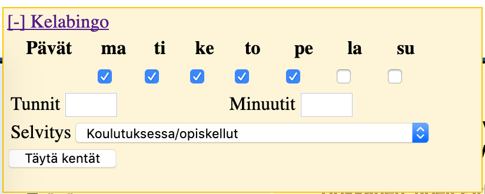

# Kelabingo v 0.5

Firefox extension [KELAn](http://kela.fi/) verkkopalvelussa lomakkeiden helpompaan täyttämiseen.

Toimii työttömyyspäivärahaa nostaessa. Kun saavutat sivun, jolla Kela kyselee mitä olet minäkin päivänä tehnyt ja kuinka kauan, tulee Kelan logon päälle nappi josta saa ikkunan auki. Tässä ikkunassa voit määritellä päivät, selitteen ja tunnit ja täyttää koko formin yhdellä napilla.

